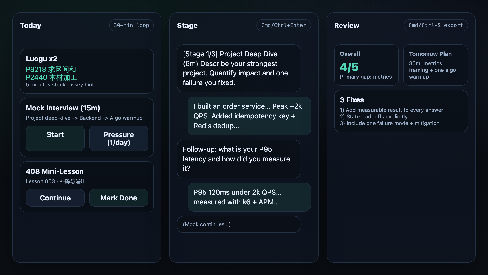
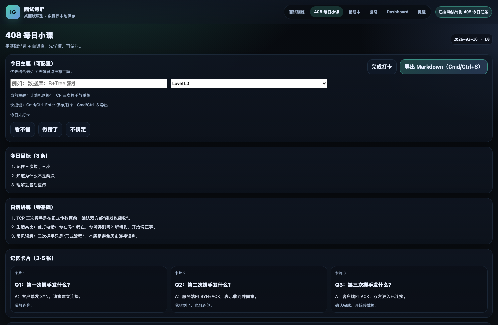
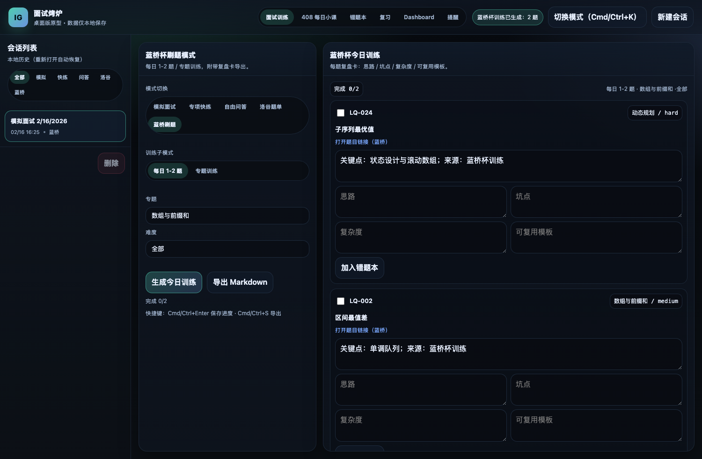
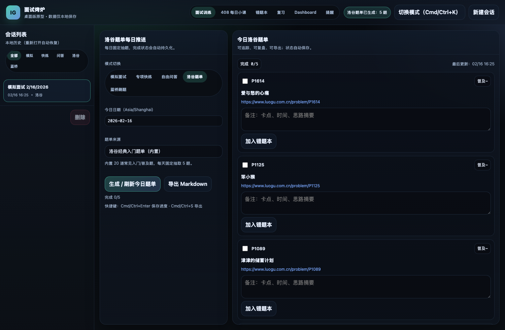
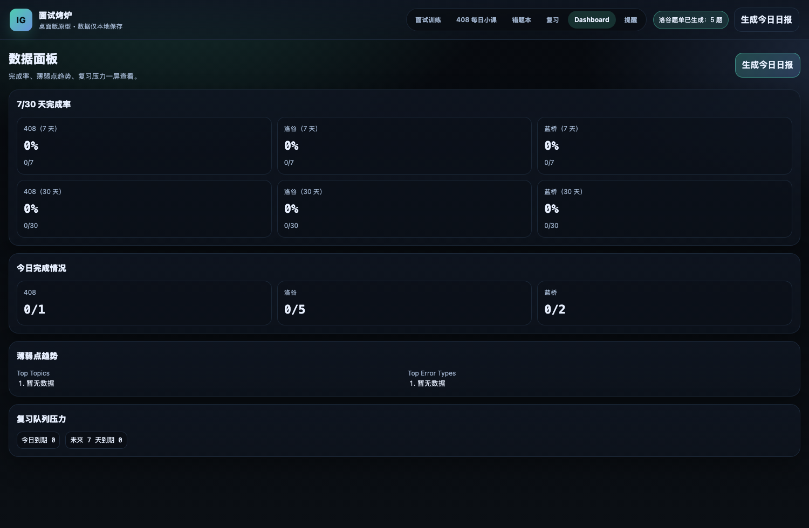
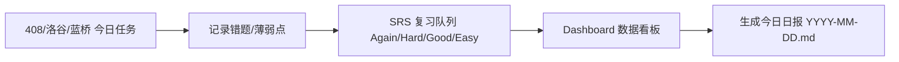

# Interview Grill（Desktop + Web）

> 一套能长期坚持的本地学习系统：面试训练 + 408 小课 + 洛谷题单 + 蓝桥刷题 + 错题本 + SRS 复习 + 日报汇总。



---

## 1. 你可以用它做什么

- 面试模拟：`模拟面试 / 专项快练 / 自由问答`
- 408 学习：`L0-L3 分级 + 自适应薄弱点`
- 算法刷题：`洛谷每日题单 + 蓝桥杯训练`
- 复盘闭环：`错题本 + SRS 复习 + Dashboard + 今日日报`
- 提醒闭环：`应用内提醒 + 点击通知跳转到对应页面`

所有数据默认只保存在本地。

---

## 2. 产品截图（图文）

### 2.1 408 每日小课（分级 + 自适应）



### 2.2 蓝桥杯刷题（题目链接 + 复盘卡）



### 2.3 洛谷每日题单（按日生成 + 打卡导出）



### 2.4 Dashboard（完成率 / 薄弱点 / 复习压力）



---

## 3. 学习闭环流程



---

## 4. 快速开始

### 4.1 安装依赖

```bash
npm install
```

### 4.2 启动

桌面版（Electron）：

```bash
npm run dev
```

仅 Web：

```bash
npm run dev:web
```

---

## 5. 快捷键（全局一致）

- `Cmd/Ctrl+K`：打开模式切换（会切回面试训练）
- `Cmd/Ctrl+S`：当前页面导出/保存
- `Cmd/Ctrl+Enter`：
  - 面试：推进 stage
  - 洛谷/蓝桥：保存今日进度
  - 408：完成打卡
- `Shift+Cmd/Ctrl+Enter`：模拟面试跳过当前阶段

---

## 6. 导出目录与命名

固定目录（桌面版）：

`/Users/zhishixuebao/.openclaw/workspace/notes/daily-github-learning/`

命名规则：

- 408：`YYYY-MM-DD-408.md`
- 洛谷：`YYYY-MM-DD-luogu.md`
- 蓝桥：`YYYY-MM-DD-lanqiao.md`
- 错题本：`YYYY-MM-DD-mistakes.md`
- 复习清单：`YYYY-MM-DD-review.md`
- 学习总日报：`YYYY-MM-DD.md`

示例：

- `/Users/zhishixuebao/.openclaw/workspace/notes/daily-github-learning/2026-02-16-408.md`
- `/Users/zhishixuebao/.openclaw/workspace/notes/daily-github-learning/2026-02-16-luogu.md`
- `/Users/zhishixuebao/.openclaw/workspace/notes/daily-github-learning/2026-02-16-lanqiao.md`

---

## 7. 关键能力说明

### 7.1 408：零基础渐进 + 自适应

- Level：`L0 / L1 / L2 / L3`
- 最近 7 天错题聚合为弱点画像
- 生成内容固定结构：目标、白话讲解、卡片、小算例、自测、薄弱点、明日建议
- 一键导出到 `-408.md`

### 7.2 洛谷：每日固定题单

- 内置题库按日期 deterministic 抽题
- 每题可勾选完成 + 备注
- 一键导出 `-luogu.md`

### 7.3 蓝桥：每日/专题训练

- 两种训练子模式：`每日 1-2 题` / `专题训练`
- 每题带“打开题目链接（蓝桥）”
- 复盘卡字段：思路 / 坑点 / 复杂度 / 模板
- 一键导出 `-lanqiao.md`

### 7.4 错题本 + SRS

- 统一错题来源：`408 / luogu / lanqiao / interview`
- 可筛选、编辑、标记 fixed、导出
- SRS 评分：Again / Hard / Good / Easy 自动更新间隔

### 7.5 Dashboard + 今日日报

- 7/30 天完成率
- 今日完成情况
- 薄弱点 Top 与复习压力
- 自动合并日文件导出 `YYYY-MM-DD.md`

---

## 8. 自动提醒与自动跳转

提醒页可配置 3 条提醒（开关 + HH:MM）：

- 408 每日小课
- 洛谷题单
- 蓝桥刷题

通知点击后跳转对应页面。重启后仍生效。

自动跳转规则（默认开启）：

1. 有到期复习 -> 复习页
2. 否则 408 未完成 -> 408
3. 否则 洛谷未完成 -> 洛谷
4. 否则 蓝桥未完成 -> 蓝桥
5. 全部完成 -> Dashboard

---

## 9. 开发检查

```bash
npm run lint
npm run test
npm run build
```

## License

MIT
